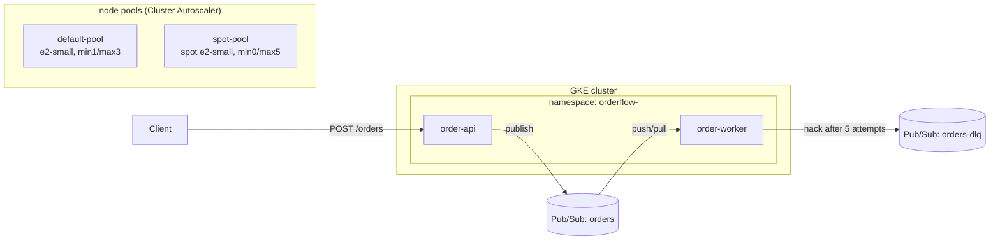

# orderflow — GKE portfolio demo

A small order-processing system used to demonstrate GKE skills beyond basic pod
deployment: complex container builds, cluster-level infrastructure, CI/CD, and
cluster/node-pool autoscaling. See [`docs/feedback-mapping.md`](docs/feedback-mapping.md)
for how each piece maps to specific review feedback.

## Architecture



- **order-api** — `POST /orders`, publishes to the `orders` Pub/Sub topic. Exposes
  `/actuator/health/{liveness,readiness}` and `/actuator/prometheus`.
- **order-worker** — subscribes to `orders-worker-sub`, manually acks/nacks; after 5
  failed attempts Pub/Sub dead-letters the message to `orders-dlq`.
- Both scale independently via per-Deployment `HorizontalPodAutoscaler`s (pod-level),
  on top of a Terraform-managed Cluster Autoscaler across two node pools (node-level).

## Repo layout

| Path | Purpose |
|---|---|
| `order-api/`, `order-worker/` | Spring Boot services, each with a multi-stage `Dockerfile` |
| `charts/orderflow/` | Helm chart: namespace, deployments, HPAs, RBAC, NetworkPolicy, PDB, ResourceQuota |
| `infra/` | Terraform: GKE cluster, 2 autoscaling node pools, Artifact Registry, Pub/Sub, Workload Identity Federation |
| `.github/workflows/` | `ci-cd.yaml` (app pipeline), `terraform.yaml` (infra pipeline) |
| `artifacts/` | Evidence collected from real runs: load-test results, scaling screenshots, pipeline logs |
| `docs/feedback-mapping.md` | Explicit mapping from each artifact back to the review feedback |

## Local verification (no cloud required)

```powershell
# Unit tests
cd order-api; mvn -q test; cd ..
cd order-worker; mvn -q test; cd ..

# Container builds
docker build -t order-api:local ./order-api
docker build -t order-worker:local ./order-worker

# Helm chart renders cleanly
helm lint charts/orderflow
helm template orderflow charts/orderflow -f charts/orderflow/values-dev.yaml

# Terraform is internally consistent
cd infra; terraform init -backend=false; terraform validate; cd ..
```

## Deploying for real

1. `gcloud auth login` and set a project with billing enabled.
2. `cd infra`, copy `terraform.tfvars.example` to `terraform.tfvars`, fill in
   `project_id` and `github_repo`, then `terraform init && terraform apply`
   (bootstrap run — see the note at the top of `.github/workflows/terraform.yaml`).
3. Take the `workload_identity_provider`, `ci_deployer_service_account`,
   `cluster_name`, and `artifact_registry_repo` Terraform outputs and set them as
   repo variables (`GCP_WORKLOAD_IDENTITY_PROVIDER`, `GCP_CI_DEPLOYER_SA_EMAIL`,
   `GCP_PROJECT_ID`, `GKE_CLUSTER_NAME`, `GKE_ZONE`) in GitHub → Settings → Secrets
   and variables → Actions.
4. Push to `develop` (deploys to `orderflow-dev`) or `main` (deploys to
   `orderflow-prod`) and watch the `CI/CD` workflow run end to end.

## Cost note

This is sized to be cheap and short-lived: a zonal Standard cluster, `e2-small`
nodes, a spot pool that scales to zero when idle. Run `terraform destroy` once
you've captured the evidence you need in `artifacts/`.
